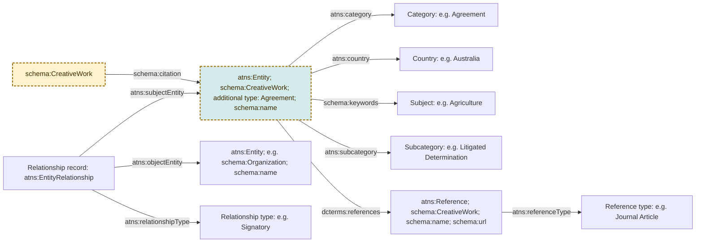

# ATNS preservation

Data extracted from the Agreements, Treaties and Negotiated Settlements [website](https://www.atns.net.au)
.

## Reproducible conversion

The current public preservation sample can be regenerated from the private ATNS XML export through a checksum-verified XML-to-CSV extraction stage and declarative `rdfcon` YAML specifications. The generated RDF is accepted only when it is graph-identical to both the curated aggregate sample and the split publication files. Manual source updates are fail-closed: duplicate identities are rejected and missing, deleted or private published records are reported for removal review. See [Conversion process](docs/conversion.md) for the security boundary, update procedure, editorial inputs, commands and equivalence checks.

## Resource model

The preserved ATNS data is a graph rather than a set of isolated records. The diagram below shows the principal connections, including how an external
creative work can cite an ATNS agreement. Boxes containing example values are resources with their own IRIs; predicates are shown on the connecting arrows.
The shaded box with the dashed border is external to the ATNS model.

`EntityRelationship` is deliberately represented as a resource, rather
than as a direct edge between two entities. This preserves the original ATNS
relationship row and allows its type and source identifier to be described.
The subject and object directions are those recorded by ATNS; any source entity
may occur in either position.

Every record from the legacy ATNS `Entities` table is typed `atns:Entity`. Records
with the source category `Agreement` are also typed `schema:CreativeWork` and
soft-typed `catobjtyp:Agreement` using `schema:additionalType`. The original
`atns:category` Agreement concept is retained as source classification evidence.
This publication pattern does not entail `odrl:Agreement`; generated ODRL policy
expressions remain separate resources. A published external class such as
`schema:Organization` may also be asserted where the mapping is clear.
Classification values such as `Category`, `Country` and `Relationship type`
remain resources, allowing stable identifiers and labels to be reused across
records.

## Integration with IDN catalogues

The complete [Agreements, Treaties and Negotiated Settlements dataset](https://data.idnau.org/pid/resource/d23405b4-fc04-47e2-9e7a-9c5735ae3780) is described in the IDN Keeping Place Catalogue and represented in this preservation graph as a `schema:Dataset`. The smaller preservation sample retains its own dataset PID and is linked to the complete dataset with `schema:isPartOf`. Every ATNS entity soft-typed `catobjtyp:Agreement` is also linked to that dataset with `schema:isPartOf`; supporting entities and references are not treated as dataset members merely because they occur in the preservation graph.

The resource model supports linking and navigation between:

- Creative works that cite an ATNS agreement entity
- Agreements referring to other creative works
- Agreements formalised with [ODRL](https://www.w3.org/ns/odrl/2/) data model

## Examples 

* [‘Changing the Mix’](https://data.idnau.org/pid/resource/f73b42cf-d39b-406c-a8c5-10a01ae0594e
) which links an external `schema:CreativeWork` to an ATNS entity that is itself
typed `schema:CreativeWork` and soft-typed `catobjtyp:Agreement`.

* [Telstra Ngaanyatjarra Indigenous Land Use Agreement (ILUA)](https://data.idnau.org/pid/resource/dd9b004b-1c22-5b53-8381-bd93760ee922), an `atns:Entity` and `schema:CreativeWork`, soft-typed `catobjtyp:Agreement`, that links to [ODRL](https://www.w3.org/ns/odrl/2/) `Agreement` > `Permission` > `Assigner` | `Use` | `Assignee` | `Target` > `Asset`, a semantic-web-friendly formalisation of the agreement.

Copyright ATNS 2020.  ATNS is maintained by the Indigenous Studies Unit at The University of Melbourne. 
This work is licensed under a Creative Commons Attribution-Non Commercial-No Derivatives 4.0 International License.
