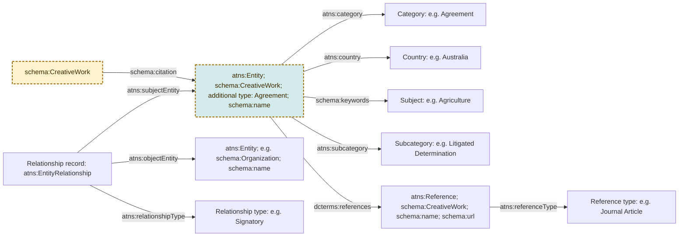

# ATNS preservation

Data extracted from the Agreements, Treaties and Negotiated Settlements [website](https://www.atns.net.au)
.

## Reproducible conversion

The current public preservation sample can be regenerated from the private ATNS XML export through a checksum-verified XML-to-CSV extraction stage and declarative `rdfcon` YAML specifications. The generated RDF is accepted only when it is graph-identical to both the curated aggregate sample and the split publication files. Manual source updates are fail-closed: duplicate identities are rejected and missing, deleted or private published records are reported for removal review. See [Conversion process](docs/conversion.md) for the security boundary, update procedure, editorial inputs, commands and equivalence checks.

## Local Prez sandbox

The repository can also generate all usable public, non-deleted records from the currently mapped ATNS tables and load them into a local Prez API. The sandbox is deliberately separate from the small curated publication sample: its generated CSV, resource registry, reports and RDF remain under ignored `build/sandbox/` paths.

Run:

```bash
task sandbox
task prez-up
```

`task prez-up` uses the same prebuilt Prez 4.23.7 Docker image as the Briscoe Smith project and exposes its API at `http://localhost:8001` by default, allowing the Briscoe Smith API to remain on port 8000. In plain language, the Docker image is the packaged Prez software; Docker starts a disposable running copy of that package, called a container, and mounts this repository's generated RDF and Prez configuration into it.

The existing PrezUI at port 3000 normally talks to an API at port 8000. To use that UI unchanged for ATNS, first stop the Briscoe Smith Prez container, then start this one on port 8000:

```bash
cd /Users/leskneebone/Projects/IDN/briscoesmith
docker compose down
cd /Users/leskneebone/Projects/IDN/atns-preservation
PREZ_PORT=8000 task prez-up
```

The local catalogue path is then `/catalogs/resource:atns-sandbox-catalogue/collections`. Use `task prez-down` to stop the ATNS API and `task prez-logs` to inspect its logs.

The sandbox includes a local copy of the existing Telstra Ngaanyatjarra demonstration ODRL graph so the custom ODRL presentation profile can be exercised. It remains a hand-authored demonstration fixture, not output generated from every source agreement. The profile also requests target geometry when that geometry is present in the local graph; it does not fetch the NNTT feature over the network.

Reviewed organisation identities and Agreement subject-agent attributions are curated in `enrichments/agent-attributions.ttl`. During the sandbox build they are merged into `build/sandbox/rdf/Entities-1.ttl`, so the reviewed `prov:qualifiedAttribution` statements and organization metadata appear with the generated entities while manual curation survives regeneration. Candidate reports under `build/sandbox/reports` remain disposable review outputs and are not loaded directly.

Reviewed Agreement spatial coverage links and the corresponding NNTT feature names are curated in `enrichments/spatial-coverage.ttl`. During the sandbox build this curated graph is merged into `build/sandbox/rdf/Entities-1.ttl`, so each enriched Agreement carries its `schema:spatialCoverage` statement in the generated entity file. These links were established through an exact NNTT file-number join that was manually sanity-checked; name-only and ambiguous spatial candidates remain unasserted. Full feature geometry remains in its authoritative spatial dataset and is not duplicated.

Agreement-classified CreativeWorks also retain a deterministic historical link
to their legacy ATNS database page using `schema:mainEntityOfPage`. The linked
resource is explicitly typed `schema:WebPage`. These links are retained in RDF
but are not requested by the current Prez presentation profile while the legacy
website remains unavailable.

## Resource model

The preserved ATNS data is a graph rather than a set of isolated records. The diagram below shows the principal connections, including how an external
creative work can cite an ATNS agreement. Boxes containing example values are resources with their own IRIs; predicates are shown on the connecting arrows.
The shaded box with the dashed border is external to the ATNS model.



`EntityRelationship` is deliberately represented as a resource, rather
than as a direct edge between two entities. This preserves the original ATNS
relationship row and allows its type and source identifier to be described.
The subject and object directions are those recorded by ATNS; any source entity
may occur in either position.

Every record from the legacy ATNS `Entities` table is typed `atns:Entity`. Records
with the source category `Agreement` are also typed `schema:CreativeWork` and
soft-typed `catobjtyp:Agreement` using `schema:additionalType`. The original
`atns:category` Agreement concept is retained as source classification evidence.
This publication pattern does not entail `odrl:Agreement`; generated ODRL policy
expressions remain separate resources. A published external class such as
`schema:Organization` may also be asserted where the mapping is clear.
Classification values such as `Category`, `Country` and `Relationship type`
remain resources, allowing stable identifiers and labels to be reused across
records.

Reviewed ODRL enrichments are linked bidirectionally to their corresponding
ATNS CreativeWork with `dcterms:relation`. Run `task audit-odrl-candidates` to
report which Agreement-classified records contain signatory relationship
evidence. The audit never generates a Permission: source signatory rows do not
by themselves establish ODRL roles, actions, targets, duties or constraints.

## Integration with IDN catalogues

The complete [Agreements, Treaties and Negotiated Settlements dataset](https://data.idnau.org/pid/resource/d23405b4-fc04-47e2-9e7a-9c5735ae3780) is described in the IDN Keeping Place Catalogue and represented in this preservation graph as a `schema:Dataset`. The smaller preservation sample retains its own dataset PID and is linked to the complete dataset with `schema:isPartOf`. Every ATNS entity soft-typed `catobjtyp:Agreement` is also linked to that dataset with `schema:isPartOf`; supporting entities and references are not treated as dataset members merely because they occur in the preservation graph.

The resource model supports linking and navigation between:

- Creative works that cite an ATNS agreement entity
- Agreements referring to other creative works
- Agreements formalised with [ODRL](https://www.w3.org/ns/odrl/2/) data model

## Examples 

* [‘Changing the Mix’](https://data.idnau.org/pid/resource/f73b42cf-d39b-406c-a8c5-10a01ae0594e
) which links an external `schema:CreativeWork` to an ATNS entity that is itself
typed `schema:CreativeWork` and soft-typed `catobjtyp:Agreement`.

* [Telstra Ngaanyatjarra Indigenous Land Use Agreement (ILUA)](https://data.idnau.org/pid/resource/dd9b004b-1c22-5b53-8381-bd93760ee922), an `atns:Entity` and `schema:CreativeWork`, soft-typed `catobjtyp:Agreement`, that links to [ODRL](https://www.w3.org/ns/odrl/2/) `Agreement` > `Permission` > `Assigner` | `Use` | `Assignee` | `Target` > `Asset`, a semantic-web-friendly formalisation of the agreement.

Copyright ATNS 2020.  ATNS is maintained by the Indigenous Studies Unit at The University of Melbourne. 
This work is licensed under a Creative Commons Attribution-Non Commercial-No Derivatives 4.0 International License.
